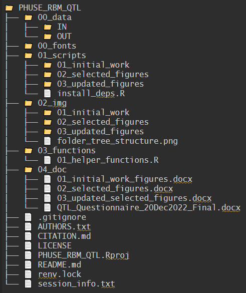

# Phuse Risk Base Monitoring

## Quality Tolerance Limits

-   Additional information can be found [HERE](https://advance.phuse.global/display/WEL/Quality+Tolerance+Limits).

-   A list of Figures (work in process) can be found [HERE](https://github.com/poncest/PHUSE_RBM_QTL/tree/main/04_report).

-   Tracker can be found [HERE](https://github.com/poncest/PHUSE_RBM_QTL/tree/main/04_report).

------------------------------------------------------------------------

# Folder Structure

